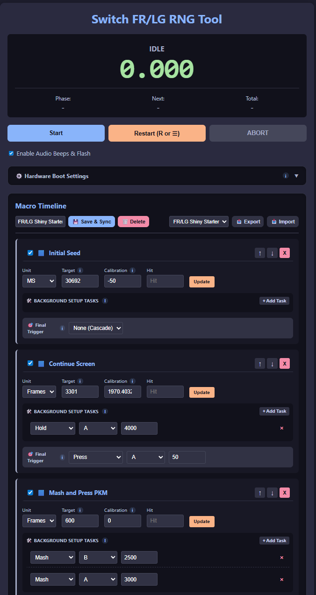
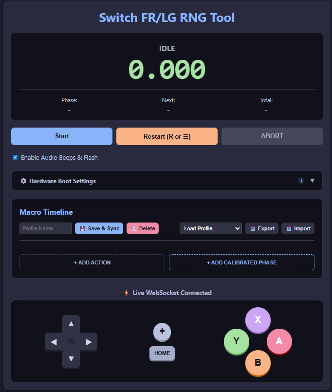
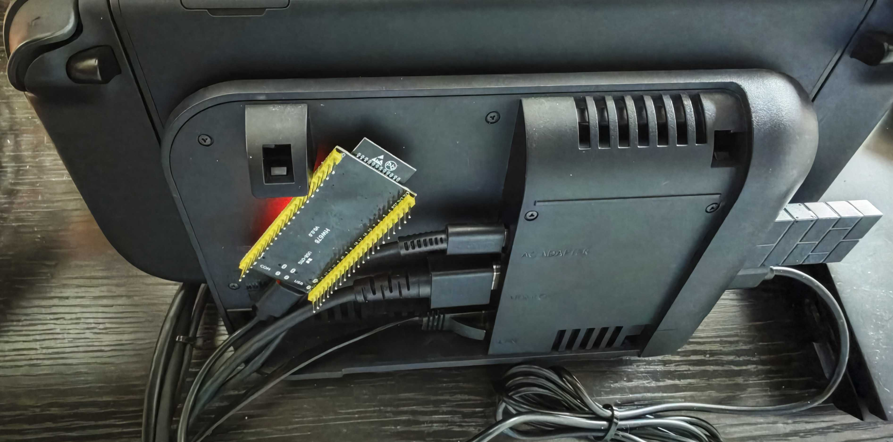
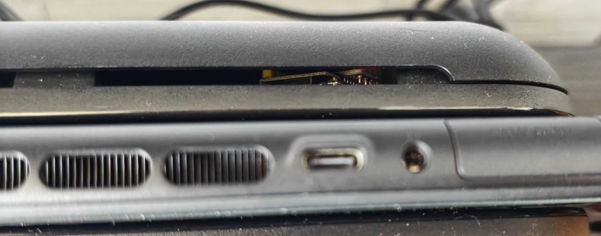
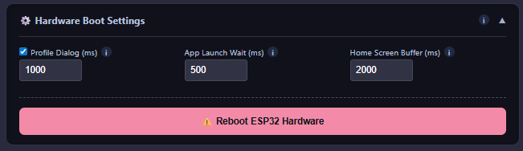
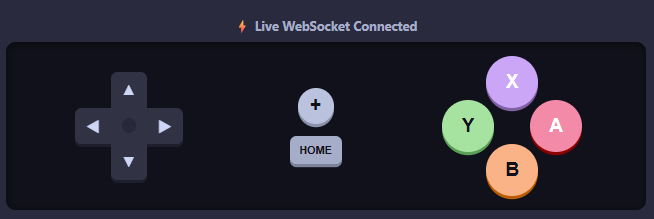

# Switch FR/LG RNG Tool (ESP32)

A high-precision, web-controlled macro engine and virtual controller designed for Nintendo Switch 1/2 RNG manipulation. Intended for use with Fire Red and Leaf Green, but could probably be utilized in other contexts. Built on the ESP32, this tool provides a microsecond-accurate timeline compiler, a WebSocket-ran virtual controller, and cross-device profile syncing.



---

## Key Features

* **Microsecond-Precise:** The ESP32 executes your macro timeline natively. During critical calibration phases, the board enters a 50ms "blackout zone" where it completely ignores network traffic to guarantee a frame-perfect hardware strike.
* **Virtual Controller:** Uses a dedicated WebSocket server (Port 81) to bypass standard HTTP handshakes, providing instantaneous 1:1 hardware passthrough for manual D-Pad and A/B/X/Y inputs.
* **"Cloud" Sync:** Macros and profiles are saved directly to the ESP32's onboard SPIFFS memory. Build a timeline on your PC, and it instantly syncs to your phone or tablet when you open the page.
* **Calibrated Phases:** Build complex sequences with Background Setup Tasks (e.g., holding 'A' to clear dialogue) while a master timer ticks down. Similarly to EonTimer, if you enter the ms/frames you missed by, the tool will adjust its calibration.
* **OTA Updates:** Flash new firmware directly from the Arduino IDE over your Wi-Fi network without ever unplugging the ESP32 from your console.

---

## Hardware & Software Requirements

### Hardware
* **ESP32 Microcontroller** (Tested on standard ESP32 / ESP32-S3).
* USB cable to connect the ESP32 to your Nintendo Switch 1/2 dock or console.

### Software Libraries (Arduino IDE)
You will need to install the following libraries via the Arduino Library Manager (`Tools > Manage Libraries...`):
* `WebSockets` by Markus Sattler (Required for the low-latency virtual controller).
* Standard ESP32 board packages (`WiFi`, `WebServer`, `SPIFFS`, `ArduinoOTA`).
* *Switch HID/Gamepad library (`switch_ESP32.h`, included in this repo)*.

---

## Installation & Setup

1. **Configure your Network:** Open `SWPkmnRNG.ino` and update the Wi-Fi credentials to match your local network:
   ```cpp
   const char* ssid = "YOUR_WIFI_NAME";         
   const char* password = "YOUR_WIFI_PASSWORD"; 
   ```
2. **Flash the ESP32:**
   Plug the ESP32 into your PC and upload the sketch via the Arduino IDE. 
3. **Find the IP Address:**
   Open the Serial Monitor (Baud rate `115200`). Once the ESP32 connects to your Wi-Fi, it will print its local IP address (e.g., `192.168.1.X`).
4. **Open the Web UI:**
   Type that IP address into the browser of your PC, phone, or tablet.
   After this is done properly, you should be greeted with a UI that looks something like this:

   

6. **OTA Flashing (Future Updates):**
   Once initially installed via USB, you no longer need a cable to update the code. In the Arduino IDE, go to `Tools > Port` and select the ESP32 under **Network Ports**.

7. **Plug into Switch 1/2:**
   You can attempt to plug it in like I have. I plugged the ESP32 into the dock so that it is always ready when I want to use it. It fits quite well inside the Switch 2 dock.

   
   
---

##  How to Use the UI

### 1. Macro Timeline
The timeline is broken down into two types of blocks:
* **Standard Actions:** Simple linear commands (`Delay`, `Press`, `Hold`, `Mash`). Useful for non-precise actions, moving to a location for example.
* **Calibrated Phases:** Advanced blocks used for precise RNG targeting. They allow you to define a target frame/time, run "Background Setup Tasks" while the timer counts down, and fire a "Final Trigger" on the exact target microsecond. Most of your blocks will be of this type.

### 2. Hardware Boot Settings
Located in the collapsible settings panel, these define the automated sequence the ESP32 performs the moment you click "Start":



* **Profile Dialog:** Time needed for the Switch to open the "Who is playing?" screen. If you're the only user, this part can be skipped by unchecking a box.
* **App Launch Wait:** Time spent between pressing 'A' to select a profile and the game loading. Make it shorter if the game loads before 'HOME' is pressed.
* **Home Screen Buffer:** Gives time for the game to load in the background.
*(Note: These are currently hard coded to always occur, but a toggle to add or remove them will be added in a later release.)*

### 3. Profile Management
* **Save & Sync:** Saves your current timeline locally and pushes it to the ESP32's internal memory. Make sure to press this when you want to move from one device to another.
* **Export/Import:** Download your profiles as a `.json` backup file to your device, or upload them to instantly flash them to the hardware. 

### 4. The Virtual Controller



Below the timeline is a live virtual gamepad. It uses WebSockets to control the Switch directly from your browser. I included this because no other controller can be used while the ESP32 is the 1st player controller.
* Desktop users can use their keyboard (Arrow Keys/WASD for D-Pad, Space for A, Shift for B, Enter for X).
* A controller connected to a desktop can also be used instead of using the web interface, as long as it can be detected by the browser. I've tested both an Xbox controller and a PS5 controller.
* Mobile users can utilize the touch-optimized D-Pad and A/B/X/Y. They may also be able to connect a controller, but that is untested.


---

## ⚠️ Troubleshooting

* **"I can't get my ESP32 connected to my WiFi!"**
  Most ESP32s only support 2.4Ghz Wi-Fi. If you only have 5Ghz, you'll need to find either another ESP32 that supports 5Ghz, find another router, or change the firmware so that the ESP32 creates its own Wi-Fi network. I may push another branch for that setup sometime in the future.
* **"I'm not getting the exact same frame every time!**
  As far as I can tell, this is mostly the Switch/FRLG's fault. Once calibrated, the ESP32 will normally miss by one frame one way or another, even if it presses the buttons at the exact same time every time. Just keep hitting 'Restart' until it finally gets everything right in one run.

   The ESP32 is emulating a Switch 1 controller, so it's limited to a 125Hz polling rate from USB. With bad timing, you can miss +- 1 frame each time from just that. When someone develops a way to emulate a Switch 2 controller, I'll implement that so that we can use a higher polling rate (I think the Switch 2 Pro Controller goes up to 1000Hz?)
* **"I docked/undocked my Switch, and it's suddenly not hitting the same frame anymore!"**
  Docking the Switch 1/2 seems to cause a change in loading the game, probably due to the processor being clocked down when in handheld. Unless you want to change your calibration all the time, always hunt with the same configuration, or have a profile for both docked/undocked.  
* **The Web UI is blank/white on load:** Your local storage JSON may have been corrupted. The code features an auto-recovery system, but if it fails, clear your browser's site data/cache for the ESP32's IP address and refresh.
* **"COMM ERROR" / WebSocket Disconnected:**
  Ensure your phone/PC is on the exact same Wi-Fi network (2.4GHz) as the ESP32.
* **Switch isn't registering inputs during macros:**
  Ensure the ESP32 is recognized by the Switch as a valid controller in the `Controllers > Change Grip/Order` menu before starting a macro. Furthermore, ensure that it is the 1st player controller. Fire Red and Leaf Green only support inputs from the 1st player controller during play.
* **Controller becomes unresponsive after a long session:**
  Open the "Hardware Boot Settings" dropdown and click the red **Reboot ESP32 Hardware** button to remotely wipe the RAM and restart the USB stack.
* **If all else fails:**
  Re-flash the firmware to the ESP32. Your profiles are not stored in the regular program memory, so they will not be affected.

---

##  License
This project is open-source and free to use. Feel free to fork, modify, and submit pull requests!
